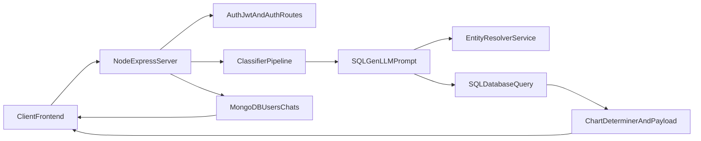

# Backend Deployment and Neon Migration Guide

This guide explains how to deploy `server/` as your single centralized backend URL and how to migrate SQL access from MySQL to your Neon PostgreSQL database (`ingresdata2025`).

## 1) Current server architecture (what runs where)

Your `server/` app currently has:
- Express API server in `server/node.js` (currently listens on port `8081`)
- MongoDB (users + chats) via `mongoose`
- MySQL (analytics SQL queries) via `mysql2` in `server/src/routes/db/dataRetrive.js`
- LLM-driven SQL generation in `server/src/routes/Modules/SQLGen.js`
- External Entity Resolver call to `http://127.0.0.1:8000/resolve-entity` in `server/src/routes/Modules/Entity_Resolve.js`



## 2) Centralized URL goal

After deployment, all frontend API calls should target one base URL, for example:
- `https://your-backend-app.fly.dev`

Then hit endpoints like:
- `POST https://your-backend-app.fly.dev/auth/login-email`
- `POST https://your-backend-app.fly.dev/chat`
- `GET https://your-backend-app.fly.dev/api/chats/:userId`

## 3) API endpoints you can hit

## Auth endpoints

From `server/src/routes/middleware/auth.js`:

- `POST /auth/signup-email`
```bash
curl -X POST "https://your-backend-app.fly.dev/auth/signup-email" \
  -H "Content-Type: application/json" \
  -d '{"name":"Test User","email":"test@example.com","password":"StrongPass123"}'
```

- `POST /auth/login-email`
```bash
curl -X POST "https://your-backend-app.fly.dev/auth/login-email" \
  -H "Content-Type: application/json" \
  -d '{"email":"test@example.com","password":"StrongPass123"}'
```

- `GET /auth/verify` (requires JWT via cookie or Bearer token)
```bash
curl -X GET "https://your-backend-app.fly.dev/auth/verify" \
  -H "Authorization: Bearer <JWT_TOKEN>"
```

- `POST /auth/logout`
```bash
curl -X POST "https://your-backend-app.fly.dev/auth/logout"
```

## Chat SQL endpoints

From `server/node.js`:

- `POST /chat` (protected by `AuthJwt`)
  - body:
    - `query` (string, required)
    - `isDetailedResponseNeeded` (boolean)
    - `isVisualizationNeeded` (boolean)
```bash
curl -X POST "https://your-backend-app.fly.dev/chat" \
  -H "Content-Type: application/json" \
  -H "Authorization: Bearer <JWT_TOKEN>" \
  -d '{"query":"show over exploited blocks in rajasthan","isDetailedResponseNeeded":false,"isVisualizationNeeded":true}'
```

- `POST /quickchat`
```bash
curl -X POST "https://your-backend-app.fly.dev/quickchat" \
  -H "Content-Type: application/json" \
  -d '{"query":"show recharge in maharashtra","isVisualizationNeeded":true}'
```

- `POST /tester` (manual route for DB + chart tests)
```bash
curl -X POST "https://your-backend-app.fly.dev/tester" \
  -H "Content-Type: application/json" \
  -d '{}'
```

- `POST /dataQuery/test` (test variant of `/chat`)
```bash
curl -X POST "https://your-backend-app.fly.dev/dataQuery/test" \
  -H "Content-Type: application/json" \
  -d '{"query":"average extraction stage in punjab","isDetailedResponseNeeded":false,"isVisualizationNeeded":false}'
```

## Chat history endpoints (MongoDB)

From `server/src/routes/chatRoutes.js`:

- `POST /api/chats`
- `GET /api/chats/:userId`
- `GET /api/chats/messages/:chatId`
- `POST /api/chats/message`
- `PUT /api/chats/rename/:chatId`
- `DELETE /api/chats/:chatId`

Examples:
```bash
curl -X POST "https://your-backend-app.fly.dev/api/chats" \
  -H "Content-Type: application/json" \
  -d '{"userId":"<mongo_user_id>","chatName":"My Chat"}'
```

```bash
curl -X GET "https://your-backend-app.fly.dev/api/chats/<mongo_user_id>"
```

## Token handling for `/chat`

`AuthJwt` accepts token in either:
- Cookie: `jwt`
- Header: `Authorization: Bearer <token>`

For web frontend, cookie-based auth can work, but cross-origin cookies need proper CORS + secure cookie config. Bearer token is usually simpler for multi-origin frontend deployment.

## 4) Required environment variables

Code currently reads these env vars:

- `MONGO_URI` (Mongo connection)
- `JWT_SECRET`
- `GEMINI_API_KEY`
- `NODE_ENV` (`production` in hosted env)
- Current SQL vars (MySQL-style): `DB_HOST`, `DB_USER`, `DB_NAME`, `DB_PASSWORD`

For Neon migration, use:
- `DATABASE_URL` (Neon Postgres connection string)

Recommended hosted env setup:
```env
NODE_ENV=production
MONGO_URI=<your_mongodb_connection>
JWT_SECRET=<your_secure_jwt_secret>
GEMINI_API_KEY=<your_gemini_key>
DATABASE_URL=<your_neon_connection_string>
```

Important:
- `server/.env.example` uses `MONGO_URL`, but code in `server/node.js` reads `MONGO_URI`. Use `MONGO_URI`.
- Do not commit real secrets into Git.

## CORS update needed

`server/node.js` currently hardcodes `allowedOrigins` for local addresses only.

Before production usage, update this array to include:
- Your deployed frontend URL (for example Vercel/Netlify URL)
- Any local dev URL you still use

If not updated, browser requests from deployed frontend will fail with CORS errors.

## 5) Fly.io deployment (preferred, Docker)

You selected Fly.io + Docker. This is a good fit for this server.

## Create a Dockerfile in `server/`

Use this template:

```dockerfile
FROM node:20-alpine
WORKDIR /app
COPY package*.json ./
RUN npm ci --omit=dev
COPY . .
EXPOSE 8081
CMD ["node", "node.js"]
```

## Launch and deploy

From repo root:

```bash
cd server
flyctl auth login
flyctl launch --no-deploy
```

During launch, set:
- App name: your preferred unique app name
- Region: closest to users
- Internal port: `8081` (because code currently listens on 8081)

Then set secrets:

```bash
flyctl secrets set NODE_ENV=production
flyctl secrets set MONGO_URI="<your_mongo_uri>"
flyctl secrets set JWT_SECRET="<your_jwt_secret>"
flyctl secrets set GEMINI_API_KEY="<your_gemini_key>"
flyctl secrets set DATABASE_URL="<your_neon_database_url>"
```

Deploy:

```bash
flyctl deploy
```

Get public URL:

```bash
flyctl status
```

## Port note

Because `server/node.js` hardcodes `app.listen(8081, ...)`, either:
- Keep Fly internal port at `8081`, or
- Later improve code to `app.listen(process.env.PORT || 8081, ...)` for platform compatibility.

## 6) Render alternative (short)

Render can also host this backend:

1. Create a new Web Service from your repo.
2. Root directory: `server/`.
3. Use Docker deployment (if using the Dockerfile above).
4. Set env vars/secrets:
   - `NODE_ENV`, `MONGO_URI`, `JWT_SECRET`, `GEMINI_API_KEY`, `DATABASE_URL`
5. Ensure Render service port matches your app behavior (`8081`) or update app code to use `process.env.PORT`.

## 7) Neon PostgreSQL replacement (MySQL -> Postgres)

This is the core migration work required.

## Where replacement is needed

1. `server/src/routes/db/dataRetrive.js`
- currently imports `mysql2/promise`
- currently creates MySQL connection using `DB_HOST/DB_USER/DB_NAME/DB_PASSWORD`
- currently executes query with `connection.execute(sql_query)`

2. `server/src/routes/Modules/SQLGen.js`
- prompt repeatedly says "MySQL"
- generated SQL uses backticks (for example `` `state` ``)
- Postgres expects double-quoted identifiers (for example `"state"`) when names contain spaces/special characters

3. `server/node.js` (`/tester` route)
- hardcoded SQL currently uses backticks
- this query must be made Postgres-compatible too

## Recommended approach (A)

Update SQL generation prompt in `SQLGen.js` to produce PostgreSQL-safe SQL directly:
- replace MySQL wording with PostgreSQL wording
- enforce identifier quoting with double quotes
- keep table name `ingresdata2025`

Example style for Postgres identifiers:
```sql
SELECT "district", ROUND(AVG("stage of ground water extraction (%)"), 2) AS "avg_extraction_stage"
FROM ingresdata2025
GROUP BY "district"
LIMIT 100;
```

## Quick fallback approach (B)

If changing prompt takes time, add preprocessing in `dataRetrive.js` before query execution:
- convert backticks to double quotes for identifiers
- then run query on Postgres

This is quick but less robust than fixing SQL generation at the source.

## `pg` migration snippet for `dataRetrive.js`

Use `pg` with Neon `DATABASE_URL`:

```js
const { Pool } = require("pg");
const ChartDeterminer = require("../Modules/ChartDeterminer");

const pool = new Pool({
  connectionString: process.env.DATABASE_URL,
  ssl: { rejectUnauthorized: false },
});

async function data_retrive(sql_query) {
  if (!sql_query || typeof sql_query !== "string") {
    throw new Error("SQL query is null or invalid");
  }

  const postgresSQL = sql_query.replace(/`([^`]+)`/g, '"$1"');
  const result = await pool.query(postgresSQL);
  const rows = result.rows || [];
  const fieldCount = rows.length > 0 ? Object.keys(rows[0]).length : 0;
  const rowCount = rows.length;
  const chartType = await ChartDeterminer(fieldCount, rowCount);
  return [rows, result.fields || [], chartType];
}

module.exports = data_retrive;
```

## Field count detail (`ChartDeterminer`)

MySQL path used `fields.length` from mysql2 metadata.  
With `pg`, derive dimensions as:
- `rowCount = rows.length`
- `fieldCount = rows.length ? Object.keys(rows[0]).length : 0`

Then call:
```js
ChartDeterminer(fieldCount, rowCount)
```

## Neon connection string

You should store your Neon URL in `DATABASE_URL` as a secret (not in code and not committed to Git).

## 8) Entity resolver dependency in production

`server/src/routes/Modules/Entity_Resolve.js` currently calls:
- `http://127.0.0.1:8000/resolve-entity`

On Fly/Render, `127.0.0.1:8000` points inside the same container, where that Python service is not running.

So for production you must:
- Host the resolver separately and use its public URL, or
- Deploy resolver in the same environment and route traffic internally, or
- Add env var `ENTITY_RESOLVER_URL` and call that URL dynamically

If this is not fixed, SQL generation quality may drop or fail for entity-heavy queries.

## 9) Practical migration checklist (file-by-file)

1. `server/package.json`
- add dependency: `pg`
- remove `mysql2` once migration is complete (optional cleanup)

2. `server/src/routes/db/dataRetrive.js`
- swap `mysql2/promise` implementation to `pg` + `DATABASE_URL`

3. `server/src/routes/Modules/SQLGen.js`
- change prompt contract from MySQL to PostgreSQL
- switch identifier instruction from backticks to double quotes

4. `server/node.js`
- update `/tester` SQL string to use double-quoted identifiers
- optionally make port configurable: `process.env.PORT || 8081`
- update CORS `allowedOrigins` with deployed frontend URL

5. `server/src/routes/Modules/Entity_Resolve.js`
- replace hardcoded local URL with environment-driven URL

## 10) Verification checklist after deployment

Run these checks in order:

1. App boot
- deployment is healthy on Fly/Render
- logs show Mongo connected

2. DB connectivity (Neon)
- run a minimal query through `/tester` or temporary test endpoint
- confirm query returns rows from `ingresdata2025`

3. Auth flow
- `POST /auth/signup-email`
- `POST /auth/login-email`
- `GET /auth/verify` with token

4. SQL pipeline flow
- `POST /dataQuery/test` with simple query
- `POST /chat` with Bearer token and query payload

5. Chat history flow
- create chat, append message, fetch chat by user

6. Frontend integration
- set frontend API base URL to deployed backend URL
- confirm CORS allows frontend origin

## 11) Common issues and fixes

- **CORS blocked in browser**
  - Add deployed frontend origin to `allowedOrigins` in `server/node.js`.

- **Server up but `/chat` fails with auth error**
  - Ensure `JWT_SECRET` is set and token passed as Bearer or cookie.

- **SQL fails with syntax around backticks**
  - SQL is still MySQL-style. Migrate prompt to Postgres style or add temporary conversion.

- **Entity resolution fails in production**
  - Replace hardcoded `127.0.0.1:8000` URL with hosted resolver URL.

- **Port binding failure on host**
  - Align host port config with app port `8081`, or update app to use `process.env.PORT`.

## 12) Stage-1 local testing (MySQL to Neon migration)

This repository now includes a Stage-1 Neon test script and health endpoint so you can validate DB migration before deployment.

### A) Configure environment

In `server/.env`, set:

```env
DATABASE_URL=postgresql://<user>:<password>@<host>/<db>?sslmode=require&channel_binding=require
```

### B) Run direct Neon script tests

From `server/`:

```bash
npm run test:neon
```

Expected: prints success, row count, and sample rows from `ingresdata2025`.

To run a custom SQL test:

```bash
npm run test:neon:sample
```

or

```bash
node scripts/testNeonConnection.js 'SELECT COUNT(*)::int AS total_rows FROM ingresdata2025;'
```

### C) Run API-level test

Start backend:

```bash
npm start
```

Then test health probe:

```bash
curl -X GET "http://localhost:8081/health/neon"
```

Expected:
- `success: true`
- `probe.total_rows` present

### D) Test existing pipeline against Neon

```bash
curl -X POST "http://localhost:8081/tester" \
  -H "Content-Type: application/json" \
  -d '{}'
```

If this works, your SQL execution path is using Neon/Postgres successfully in Stage-1.

### E) Important schema compatibility note

Your Neon table uses underscored column names (for example `_state`, `assessment_unit_name`, `stage_of_ground_water_extraction_(%)`), while existing SQL generation logic still refers to legacy names with spaces.

Stage-1 code now includes a compatibility mapper in `server/src/routes/db/dataRetrive.js` that translates legacy generated identifiers to your Neon column names before executing SQL.

This lets you test the flow immediately. In Stage-2 cleanup, migrate `SQLGen.js` prompts directly to Neon-native column names so this mapper can be removed later.
